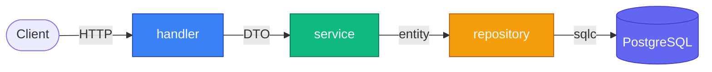

<div align="center">

# 🏗️ go-clean-arch

**One-command scaffolder for Go backend projects with clean architecture**

[](https://www.gnu.org/software/bash/)
[](https://go.dev)
[]()
[](LICENSE)

<br />

Stop re-creating the same folder structure every project.
Start from a clean, opinionated baseline that matches production Go backend conventions.

</div>

---

## ⚡ Demo

```console
$ go-clean-arch web-streaming github.com/rafi/web-streaming

🚀  Scaffolding: web-streaming
📦  Module: github.com/rafi/web-streaming

✅  Done! Project created at ./web-streaming

Next steps:
  cd web-streaming
  cp .env.example .env
  go mod tidy
  go run ./cmd/api
```

That's it. Folder structure, `go.mod`, `sqlc.yaml`, `.env.example`, `.gitignore`, and a working `/health` endpoint — all generated in under a second.

---

## 🎯 Why

| Without `go-clean-arch` | With `go-clean-arch` |
|---|---|
| Manually `mkdir` 12+ folders | Single command |
| Forget `.gitignore` half the time | Always included |
| Copy-paste `sqlc.yaml` from old project | Pre-configured |
| Inconsistent layout across projects | Enforced convention |
| ~3 minutes setup per project | ~1 second |

---

## 📦 Install

```bash
git clone https://github.com/Restartor/go-clean-arch.git
cd go-clean-arch
bash install.sh
source ~/.bashrc   # or ~/.zshrc
```

The installer copies the script to `~/.local/bin/go-clean-arch` and adds it to your `PATH`.
**No sudo, no system-wide changes.**

---

## 🚀 Usage

```bash
go-clean-arch <project-name> [module-path]
```

<table>
<tr>
<td>

**Minimal**
```bash
go-clean-arch my-api
```
Module path defaults to
`github.com/youruser/<project-name>`

</td>
<td>

**With explicit module path**
```bash
go-clean-arch web-streaming \
  github.com/rafi/web-streaming
```

</td>
</tr>
</table>

After scaffolding:

```bash
cd web-streaming
cp .env.example .env
go mod tidy
go run ./cmd/api
# → Server running on :8080
# → curl localhost:8080/health → {"status":"ok"}
```

---

## 🧱 Architecture



Dependencies always point **inward**. Inner layers never know about outer layers.

---

## 📁 What gets generated

```
<project-name>/
├── cmd/
│   └── api/
│       └── main.go              # entrypoint with /health endpoint
├── internal/
│   ├── config/                  # env loading
│   ├── database/                # sqlc generated code + db connection
│   ├── handler/                 # HTTP handlers
│   ├── service/                 # business logic
│   ├── repository/              # data access
│   ├── middleware/              # JWT, rate limit, logger
│   ├── dto/                     # request/response shapes
│   ├── entity/                  # domain structs
│   ├── router/                  # route registration
│   ├── auth/                    # token generation/validation
│   ├── logger/                  # structured logger
│   └── response/                # unified response helpers
├── migrations/                  # .sql migration files
├── queries/                     # .sql query files for sqlc
├── sqlc.yaml                    # sqlc configuration
├── go.mod
├── .env.example                 # env template
├── .gitignore
└── README.md
```

---

## 🧩 Layer Responsibilities

| Layer | Responsibility | Depends on |
|---|---|---|
| **handler** | Parse HTTP, call service, return response | `service`, `dto`, `response` |
| **service** | Business logic, validation, orchestration | `repository`, `entity` |
| **repository** | Data access only — no business logic | `database`, `entity` |
| **entity** | Pure domain structs | _nothing_ |
| **dto** | API request/response shapes | _nothing_ |

---

## 🔧 Stack assumptions

The scaffold is opinionated for:

- 🐹 **Go 1.22+** with standard project layout
- 🐘 **PostgreSQL + sqlc** — typed queries, no ORM magic
- 🔐 **JWT auth** — access + refresh token expiry pre-configured
- ⚡ **Redis-ready** — for token blacklist and rate limiting

Don't need one of these? Just delete the folder. The scaffold is a starting point, not a cage.

---

## 🛠️ Customization

The entire scaffolder is a single bash file: [`go-clean-arch.sh`](./go-clean-arch.sh).

Fork it, edit the heredoc sections to match your own conventions:
- Different Go version
- Different default port
- Extra layers (`event/`, `notification/`, etc.)
- Your own README template
- Pre-installed dependencies (Gin, GORM, sqlx, ...)

---

## 🗑️ Uninstall

```bash
rm ~/.local/bin/go-clean-arch
```

Then remove the PATH line from your `~/.bashrc` or `~/.zshrc` if you no longer need it.

---

## 📋 Requirements

- bash or zsh
- Go 1.22+ _(for the generated project, not the scaffolder)_

---

<div align="center">

**Built by [@Restartor](https://github.com/Restartor)** · MIT License

</div>
